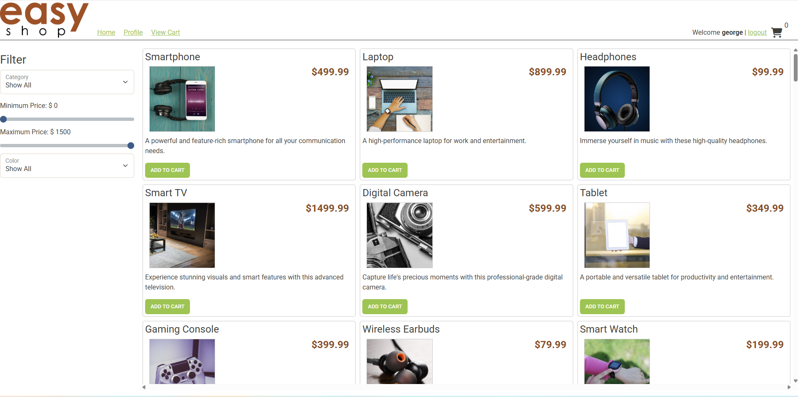

# 🛒 EasyShop - E-Commerce API (Version 2)

## 📌 Overview

EasyShop is a Spring Boot RESTful API backend for an online store. This capstone project focuses on improving and extending version 1 of the API by fixing bugs, adding role-based category management, enabling profile management, and implementing a complete checkout process.

This backend integrates with a MySQL database and uses JWT authentication. It powers a frontend shopping website (included in the starter code) and is testable via Postman.

---

## 🛠 Technologies Used

- Java 17

- Spring Boot

- Spring Security (JWT Authentication)

- MySQL

- JDBC

- Maven

- Postman (for API testing)

- Git & GitHub

---

## 🗂 Features Implemented

### 🧪 Bug Fixes

- ✅ Fixed broken product search/filter functionality in `ProductDao`

- ✅ Added unit tests to verify filtering by search term, price range, and category

### 📦 Category Management (Admin Only)

- `GET /categories` – Get all categories

- `GET /categories/{id}` – Get one category by ID

- `POST /categories` – Create new category

- `PUT /categories/{id}` – Update category

- `DELETE /categories/{id}` – Delete category
> All endpoints restricted to users with `ADMIN` role

### 👤 User Profile

- `GET /profile` – View current user profile

- `PUT /profile` – Update user profile
> Profile is created automatically at registration

### 🛒 Checkout System

- `POST /orders` – Converts current shopping cart into a finalized order

  - Inserts order into `orders` table

  - Adds line items into `order_line_items`

  - Clears the user's shopping cart

  - Includes shipping and total amount

---
## 📸 Screenshots
### 🏠 Home Page

### 🛒 Cart with Added Product

### ✅ Checkout Confirmation

### 👤 Get Profile

### ✏️ Update Profile

 
